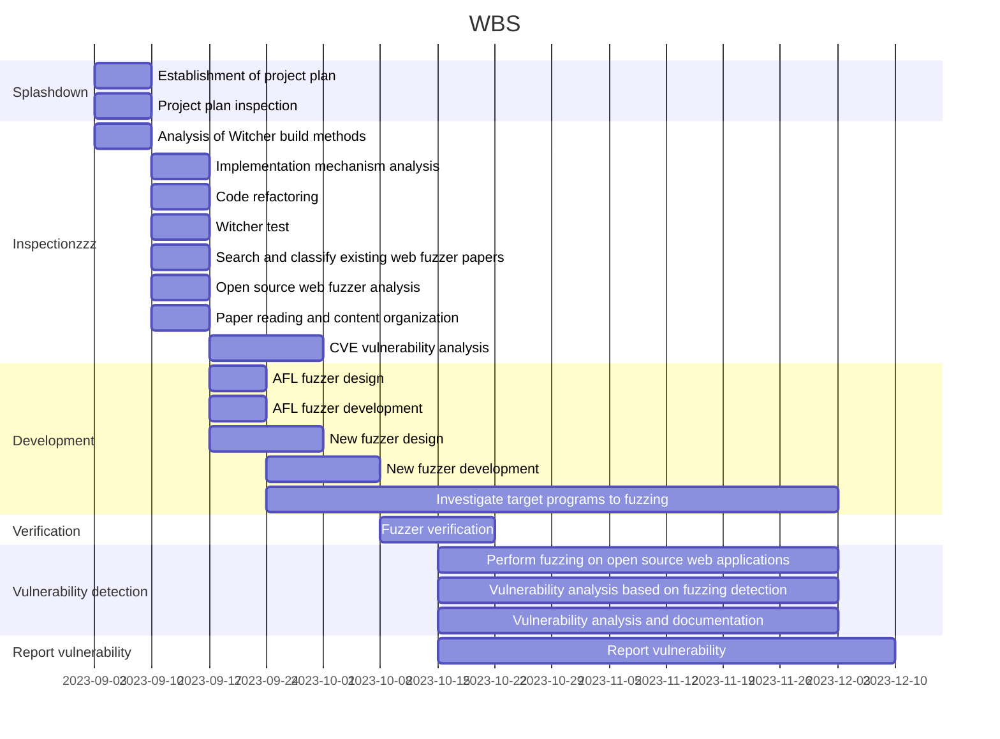

# BoB 12th Project - Team WTF (Web The Fuzz)

```
            _       __     __  ________         ______                         
           | |     / /__  / /_/_  __/ /_  ___  / ____/_  __________  ___  _____
           | | /| / / _ \/ __ \/ / / __ \/ _ \/ /_  / / / /_  /_  / / _ \/ ___/
           | |/ |/ /  __/ /_/ / / / / / /  __/ __/ / /_/ / / /_/ /_/  __/ /    
           |__/|__/\___/_.___/_/ /_/ /_/\___/_/    \__,_/ /___/___/\___/_/
```

Development of a Generic Web Application Fuzzer based on Witcher Fuzzer : Find Vulnerability in Open Source Application

## WBS




